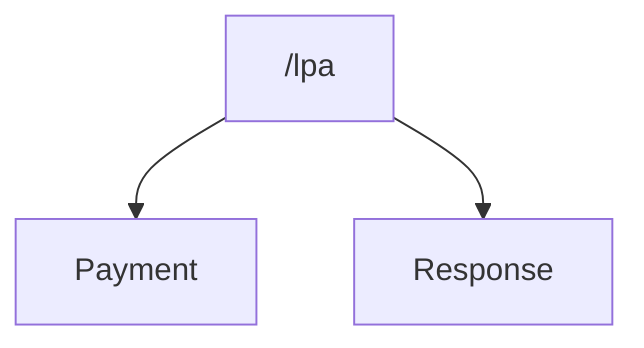

## Introduction

TODO: xxx% of our users on the Make an LPA Service are done by Solicitors on behalf of clients.

Citation: [Lasting Power of Attorney Statistics](https://www.lastingpowerofattorney.service.gov.uk/stats)

We need to explore a way of enabling this group of users to interact with their systems more efficiently.

We know that most solicitors firms use a small range of software providers and work with a group called the [Legal Software Suppliers Association](https://www.lssa.co.uk) (LSSA).

The companies behind this software have a keen interest in integrating with our service through code so that they can streamline their processes and automate work.

They already integrate with other government services like the Land Registry.

### Legal Software Suppliers Association (LSSA)

> The Legal Software Suppliers Association (LSSA) is the UK industry body for legal systems developers and vendors. Representing most of the leading UK suppliers, it aims to both set and maintain professional standards within the industry and manage areas of mutual interest between lawyers and software providers.

Working with the LSSA and those outside of them will be key to unlocking the full potential of any new service we create.

## OPG as a Service

> An API is not "just" an API

There is more to building an API than providing consumers with an endpoint to connect to.

To accomplish providing an integration for the users of our service, we need to build something that does the following:

- Allow the user to Self Service
- Quality support expected of a service that is widely used
- A testing environment for new and existing integrations
- Information on the service status
- Well documented schema and versioning strategy
- Allows the consumer to easily integrate into their existing software platforms
- Communicate data flows and business logic for an LPA lifecycle

We should take the learnings from the existing [GOV.UK Notify](https://www.notifications.service.gov.uk/) and [GOV.UK Pay](https://www.payments.service.gov.uk/) services which provide a centralised API for any government service to integrate with.

We should follow the patterns they use, including their url structure, design and features.

Below is an example of how this may be structured

| Component | Description |
|---|---|
| **Documentation** | Details on how to use the service from sign up to implementation |
| **Account Management** | Manage your account resources in a self service way |
| Organisation Details | Solicitor, Charity, Company or third party details management |
| User Details | Individual user details associated with the organisation. This allows for better auditing with interactions within the API |
| API Keys | Each Organisation has a unique API Key that is required for any API calls |
| API Throttling Limits | Throttling rules shown to understand your allowed usage of the service |
| Audit Trails | Anonymised logs to allow you to Audit activity within your organisation |
| **Support** | Provide technical support to users of the service |
| Uptime and Issues Dashboard | Dashboard with current and past service uptime, alerting hooks for integrations into 3rd party tooling such as Slack and scheduled maintenance times |
| Sandbox | A testing environment for new integrations or testing out code against newer versions of APIs |
| **API** | Endpoints for external parties to integrate with |
| Security | IP Range, API Key (Organisation) and UserID (User Details ID) all set for requests to the API |
| Responses | JSON and potentially FHIR+JSON for the NHS |
| OpenAPI Specifications | Defined OpenAPI specifications allowing mocks and integration checks. There is a potential for Contract Testing here too |
| API Design Styles | REST or GraphQL. Our Domain supports REST more than GraphQL so REST is probably the way we will go |
| **Internal Government Services** |  |
| [GOV.UK Notify](https://www.notifications.service.gov.uk/) | Sending of emails, texts and letters |
| [GOV.UK Pay](https://www.payments.service.gov.uk/) | For the handling of payments through the process |

## Example API Endpoints

Below are a list of potential endpoints we could implement within OPG as a Service.

### Example API Flow 1

### Example API Flow 2

### Using the API Flow

### View an LPA

## Conclusion

## References

- [Lasting Power of Attorney Statistics](https://www.lastingpowerofattorney.service.gov.uk/stats)
- [GOV.UK Notify](https://www.notifications.service.gov.uk/)
- [GOV.UK Pay](https://www.payments.service.gov.uk/)
